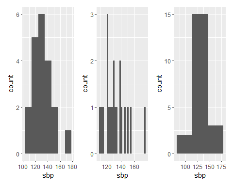
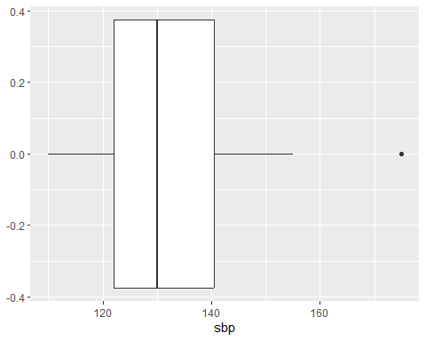

## Outline  

1.  Classify data and check errors or missing values  

2.  Visualize and explore the data  

3.  Measure Centrl tendency  

4.  Measure Dispersion  

5.  Outliers  

## Classify data  

-   Numerical or Categorical  

-   Numerical --> Continuous or Discrete    

-   Categorical --> Nominal or Ordinal    

## Error checking  

-   Categorical data --> Category check

-   Numerical data --> Range check  

## Missing values  

-   Check the missing codes [NAs or user defined NA or tagged NA like -9,99]  

-   Investigate the reason for missing  
    -   Completely at random  
    -   At random  
    -   Not at random  
    
## Data visualization and exploring data  

-   Numerical variables  
    -   Histogrm   
    -   Boxplot

-   Categorical variables  
    -   Bar graph  
    -   Pie chart  
    
##  Measures of centrl tendency  

-   Numerical variable 
    -   if symmetric without extreme value --> arithmetic mean  
    -   if positive skewed --> geometric mean  
    -   if outliers pull the mean --> trimmed mean  
    -   Median is more robust to skewed data

##  Measures of centrl tendency   

-   Ordinal variable  
    -   mode or median  
    -   mean for comparing two group  
    
-   Nominal variable --> mode  

-   Arithmetic mean is useful for inferential statistics or total 

## Measures of dispersion  

-   Range shows the total spread: minimum and maximum  

-   Standard deviation shows average spread for the normally distributed data  
    -   2SD - mean + 2SD is 95% of data for normal distribution

-   Interquartile range show spread of central 50%  of data
    -   Inter-decile range shows middle 80% of data

-   Coefficient of variation CV shows relative variability  

## Outlier  

-   Can be seen in box-plot and stem and leaf plot  

-   Beyond 1.5 times IQR from the Q1 & Q3  

-   Needs investigation  
    -   natural outlier or errors  
    
    


## Systolic Blood Pressure (SBP) in 20 Patients (mmHg) after a 4-week trial of Medication X  


| sbp|
|---:|
| 110|
| 112|
| 115|
| 120|
| 122|
| 122|
| 124|
| 125|
| 128|
| 130|

## Histograms

<!-- -->

## Boxplot
<!-- -->

## Stem and leaf

```

  The decimal point is 1 digit(s) to the right of the |

  10 | 025
  12 | 02245800258
  14 | 02505
  16 | 5
```

## Summary table

|Measures |    SBP|
|:--------|------:|
|Mean     | 132.50|
|Median   | 130.00|
|SD       |  15.78|
|IQR      |  18.50|
|Q1       | 122.00|
|Q3       | 140.50|

