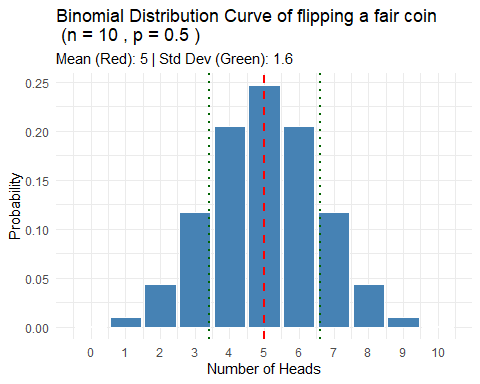
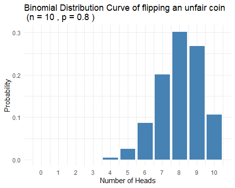

## What is a probability distribution?

-   Mathematical model that characterizes a *population*

-   Describes all possible values of a random variable

-   Describes likelihood associated with each value

## Main categories of probability distribution

1.  Discrete probability distributions
    -   Binomial distribution

    -   Poisson distribution
2.  Continuous probability distributions
    -   Normal distribution

    -   t distribution

    -   F distribution

    -   Chi square distribution

## Two rules of a valid probability distribution

-   Probability of any event cannot be negative

-   Total sum of all probabilities = 1 (Total area under the curve = 1)

## Binomial distribution

-   Describes the number of successes in a fixed number of trial (n)

-   Each trial has only two *mutually exclusive* outcomes (p,1-p)

-   Used in analysing proportions or risk (dead/alive; treatment success/fail)

-   *Probability* of success (p) must be *constant* for every trial

-   *Outcome* of one trial must be *independent* of the result of another trial

## Parameters of binomial distribution

-   Mean (measure of central tendency) is $\mu = n \times p$

-   Variance (measure of spread) is $\sigma^2 = n \times p \times (1-p)$

-   Parameters are *number of trials (n)* and *probability of success (p)*

## Binomial distribution formuala

$$P(X = x) = {}_nC_x \cdot p^x \cdot (1-p)^{n-x}$$

## Example of binomial distribution

-   Let's flip a fair coin for 10 times and the probability of head is *p*

-   p = 0.5; n = 10

-   $\mu = p \times n = 5$

-   $\sigma^2 = n \cdot p \cdot (1-p) = 2.5$ ; $\sigma = 1.581$

## Data

|  x|         y|
|--:|---------:|
|  0| 0.0009766|
|  1| 0.0097656|
|  2| 0.0439453|
|  3| 0.1171875|
|  4| 0.2050781|
|  5| 0.2460938|
|  6| 0.2050781|
|  7| 0.1171875|
|  8| 0.0439453|
|  9| 0.0097656|
| 10| 0.0009766|

## Binomial Distribution  

<!-- -->

## Binomial distribution of an unfair coin

<!-- -->

