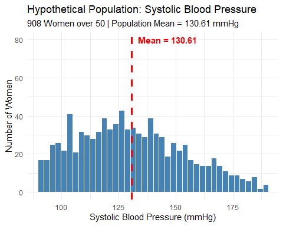
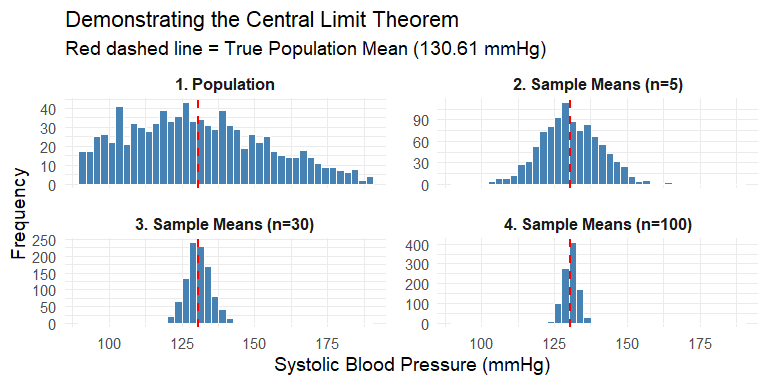

## Definition of sampling distribution

-   Theoretical distribution\
-   A series of statistic from independent random samples of *same size* from *same population*\
-   Shape and spread depends on sample size (n) and variation in parent population

## Hypothetical population data

-   1000 population of \>50 years old women

-   Gamma distribution to get a right skewed distribution

-   Get the range of systolic blood pressure between 90mmHg and 190mmHg

-   The population mean is 131.

## Distribution of the data

<!-- -->

## Sampling

-   From this population of 908 women, **1000 samples** will be taken 3 ways
    1.  **5 women** in each sample
    2.  **30 women** in each sample
    3.  **100 women** in each sample
-   Then, we calculate the **sample statistic(mean)** of each sample and distribute along the X axis

## Sample Statistics

|Group                   | Size|  Mean| Median|   SD|    Q1|    Q3|   Min|   Max|
|:-----------------------|----:|-----:|------:|----:|-----:|-----:|-----:|-----:|
|1. Population           |  908| 130.6|  128.2| 23.5| 112.0| 147.1|  90.0| 188.5|
|2. Sample Means (n=5)   | 1000| 130.5|  129.9| 10.4| 123.3| 137.5|  98.7| 168.3|
|3. Sample Means (n=30)  | 1000| 130.6|  130.4|  4.2| 127.9| 133.3| 116.6| 145.2|
|4. Sample Means (n=100) | 1000| 130.6|  130.7|  2.4| 129.0| 132.2| 123.9| 137.7|

## Sampling Distribution

-   When the sample size is large enough\
-   Distribution of the sample means follows **Normal distribution**\
-   **Mean of the samples' means** is equal to **True Population mean** ($\bar{X}=\mu$)

$$ \bar{X} = \frac{\sum_{i=1}^{n}{X_i}}{n}$$

## Distribution of Sample means

<!-- -->

## Distribution of the estimates

-   *Mean of Sample means*$(\bar{X})$= 131
-   Standard error of the mean (***SEM***) measures the variability of the distribution
-   If population SD is known, $SEM = \frac{\sigma }{\sqrt{n}}$
-   if only one sample SD is known, $SEM = \frac{s}{\sqrt{n}}$
-   Large *SEM* - Imprecise estimate
-   Small *SEM* - Precise estimate

## Standard error of the estimate

|ID         |   N|  Mean|  SEM|
|:----------|---:|-----:|----:|
|Population | 908| 130.6|  0.8|
|1          |   5| 131.3| 12.4|
|2          |  30| 136.8|  3.6|
|3          | 100| 130.2|  2.4|
|4          | 500| 129.9|  1.0|

## Central limits theorem

-   As sample size increases, the distribution of sample means approaches a normal curve regardless of the original population's shape.
-   The sampling distribution stays centred at the true population mean and its variance is $\frac{population\ variance}{sample\ size}$ 
-   Standard error decreases as sample size grows
-   The Central Limit Theorem and sampling distribution are foundation for inferential statistics.

## Use in inferential statistics

-   **Confidence Interval (CI)**: 
$$Estimator \pm Reliability\ Coefficient \times Standard\ Error$$

-   **Test Statistic (for P-values)**:

$$\frac{Relevant\ Statistic - Hypothesized\ Parameter}{Standard\ error}$$

# Thank you
